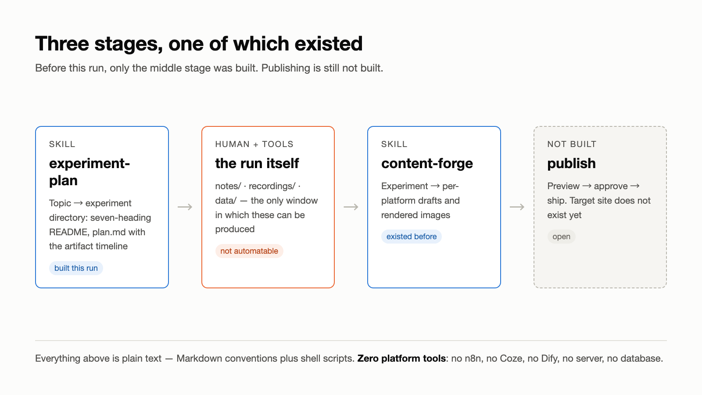
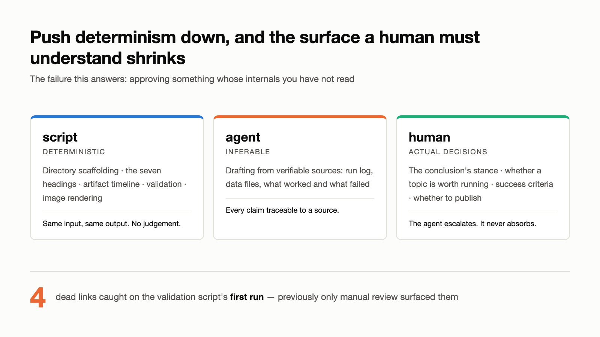

The starting condition is common enough to be boring: you follow the field, you have opinions worth writing down, and you publish nothing. Tools get compared. Approaches get researched. Best practices get collected. Nothing ships.

The fix I settled on was a container — treat every idea worth trying as an *experiment*: one directory, one record, one public write-up. And the first experiment was to build the recording machinery itself, using an agent.

It took half a day. Then it turned out to be unusable.

## The question

Can a content pipeline run on nothing but Markdown conventions and Claude Code skills — no n8n, no Coze, no Dify, no server, no database?

The answer to that narrow question is yes, and it is the least interesting result here.

## Setup

Two repositories, both plain text end to end:

| Repo | Role |
| --- | --- |
| `silicon-leap-forge` | the pipeline: skills, platform configs, templates, conventions |
| `silicon-leap-lab` | experiment records; both input and output live here |

Two skills: `experiment-plan` turns a one-line topic into a runnable experiment directory; `content-forge` turns a finished experiment into per-platform drafts. Environment: macOS, Claude Code CLI, git. Nothing else installed for this.

*The pipeline before and after this run. Only the middle stage existed; publishing is still open.*

## What complete looks like when it is empty

The generated skill had frontmatter, a numbered flow, a hard-constraints list, and an acceptance checklist. Approving it took one sentence.

Running it produced the failure. The Xiaohongshu draft was unreadable — not wrong, just dead. Tracing it back, the template hardcoded a three-part list skeleton: *Results / What worked / What went wrong*.

In a different file of the same configuration sat this line:

> States the facts, then falls into a list. No situation, no reaction, numbers with no reference point.

The config was criticizing the template. The template was violating the config. **Read separately, both files were correct.** The contradiction only existed in the output.

The visual-assets section had the same shape of defect. It specified "emit SVG source, rendered by the author." This machine has no `rsvg-convert`, no ImageMagick, no `wkhtmltoimage`. The rule was unexecutable from the day it was written.

## Why the output lands there

An agent's training and generation are large-scale statistics over existing data. The output regresses to the mean, and the mean is mediocrity.

That is not a capability gap. It is how the thing works. A stronger model produces a more polished mean — it still will not spontaneously notice that a template contradicts a config two files away, or check whether a renderer exists on this particular machine.

The corollary is where the leverage is: **the polish belongs in the instructions, not the artifact.** Rewriting the output once fixes one document. Writing down what to refuse fixes every future run.

## What that looked like in practice

- A seven-item anti-AI-tone list: canned section headings, benefit lists, buzzwords, "first/second/finally" scaffolding, degree words with no data behind them, universal sign-offs.
- A required narrative arc — shared situation → what was done → what it hit → what was learned — added to the distillation step, so a record with only the middle beat is caught as a log dump.
- The Xiaohongshu template rewritten from a list skeleton back into narrative structure.
- Determinism pushed down into shell scripts: directory scaffolding, validation, image rendering.

*Determinism belongs in scripts. What remains is what a human actually has to decide.*

That last one is the durable part. A validation script now checks the deterministic invariants — heading text matches the parser interface verbatim, no empty cells in the step table, every relative link in `drafts/` resolves. Its first run caught four dead links that had previously only surfaced through manual review.

Images follow the same principle: HTML source is committed and diffable, PNGs are build products rendered by headless Chrome. No additional install.

## Results

| Metric | Value | Source |
| --- | --- | --- |
| Pipeline stages covered before this run | 1 of 3 (middle only) | code review |
| Skill files | 12 | `find` count |
| Platform configs / templates | 5 / 7 | `platforms/`, `templates/` |
| Information leaks found | 2 (commit author, absolute-path symlink) | git history + symlink scan |
| Execution failures | 1 (`cp -R` nesting) | run log |
| Identity-isolation scenarios verified | 3 / 3 | `includeIf` test |
| Platform-tool dependencies | 0 | no n8n / Coze / Dify |
| Screen recordings | 0 | known gap |
| Wall-clock time, token usage | not recorded | see caveats |

## Caveats

This record is retroactive. `plan.md` was reconstructed after the run, so the "expected counterintuitive finding" section had to be replaced with actual findings — a prediction written after the fact is worth nothing.

No timing or token data was captured, and `--reset-author` overwrote the commit timestamps, so git history cannot substitute for it. There are no recordings: `asciinema` was never installed on this machine, and more fundamentally, the work happens as a conversation with an agent rather than as hand-typed commands, so there is no "human operating a terminal" to record. The real process record is the conversation, and this run did not preserve it as source material.

## Conclusion

TODO — author's take is drafted but not finalized. See the experiment README.

## Reproduce

Everything is plain text. The experiment record, the skills, the platform configs, the templates, and the image sources are all in [`silicon-leap-lab`](https://github.com/) under `experiments/2026-08-markdown-only-content-pipeline/`.
