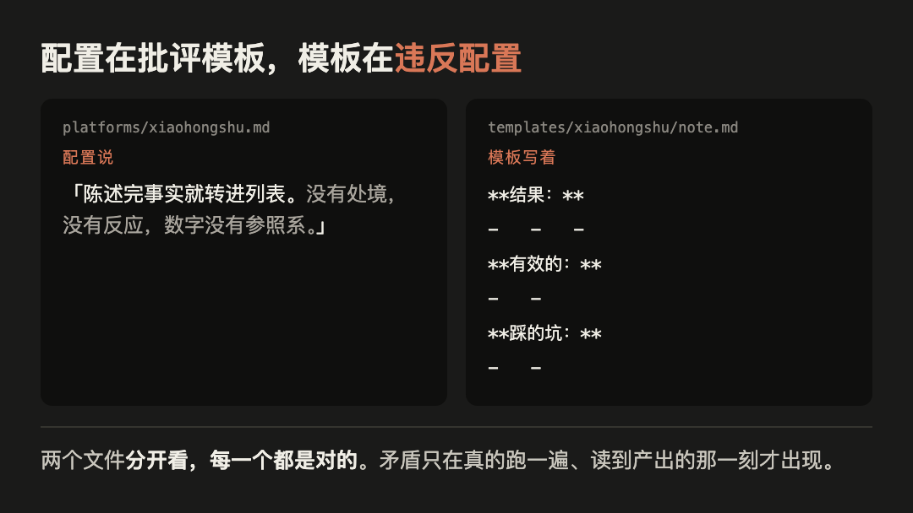
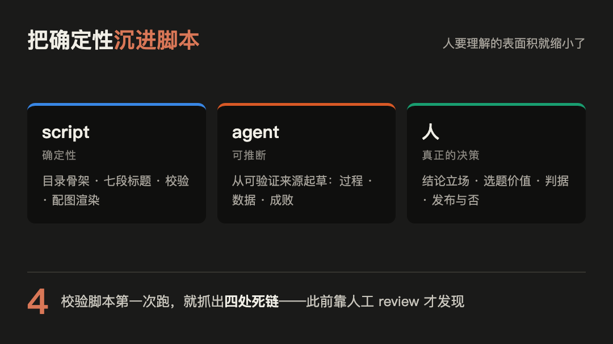

收藏夹里躺着一千篇「以后要做」，换不来一次真正的成长。这次我用 AI 搭了一条内容流水线，再用它记录这次实验本身。骨架半天搭完，第一篇内容却卡了一周多。

跑完之后，有两件事和我原来想的不一样。

**一、AI 确实能一次给多个平台写出风格不同的文案，这件事也确实能自动化，但没有网上说的那么顺。** 自动化本身要打磨：模板、约束、审核环节，每一样都得自己搭、自己修。跟 AI 许一个愿，换不来一篇能发的文章。

**二、文案质量不该靠抽卡。** 同一个模型，给什么约束就出什么水平。平庸不是模型的属性，是默认值——没有明确约束时，生成自然回归均值，而均值就是平庸。真正起作用的是工程约束：写清「不要什么」的 skill、逐条落地的 prompt、简报确认加独立审核的流程。换个更大的模型，只会得到一个更精致的均值。

下面是这一周多具体发生了什么。

## 这套东西是什么

两个仓库，全是纯文本：`silicon-leap-forge` 放流水线本体（skill、平台配置、模板），`silicon-leap-lab` 放实验记录，输入输出都在这里。

两个 skill：`experiment-plan` 把一句话选题变成能照着跑的实验目录，`content-forge` 把跑完的实验变成各平台初稿。环境是 macOS 加 Claude Code CLI 加 git，没装别的东西。

要验证的是：只靠 Markdown 约定加 skill，不用 n8n、Coze、Dify，不用服务器和数据库，这条流水线能不能真跑起来。答案是能，但这是整个实验里最不重要的结论。

## 完整的外观，空的内容

生成出来的 skill 有 frontmatter，有分步流程，有硬约束清单，还有验收标准。读起来像个成熟的东西。我批准它只花了一句话：

> 可以，写出来，后续软链我想办法建

（[`notes/session-timeline.md`](https://github.com/siliconleap/silicon-leap-lab/blob/master/experiments/2026-08-markdown-only-content-pipeline/notes/session-timeline.md)，2026-08-09 07:11:50）

直到我让它真的跑一遍。第一篇小红书文案枯燥得读不下去。不是写错了，是没法看。

*图 1：配置与模板的实际内容对照，来源为本次实验的两个文件*

翻开模板才看见根子：里面硬编码了「结果」「有效的」「踩的坑」三段列表。而同一套配置的另一个文件（`platforms/xiaohongshu.md`）里写着：

> 陈述完事实就转进列表。没有处境，没有反应，数字没有参照系。

配置在骂模板，模板在违反配置。麻烦的地方在于，两个文件分开看每一个都是对的，矛盾只在真跑一遍、读到产出的那一刻才出现。

同一节里还有一条从没能执行的规则：配图要求「输出 SVG 源文件，由人渲染」，而这台机器上 rsvg-convert、ImageMagick、wkhtmltoimage 一个都没装。它读起来合理，也符合「纯文本、可版本控制」的目标，唯独没人确认过本机有没有渲染器。

## 卡住的一周多

代码没卡住，卡住的是我。初稿看起来完整，读起来没有一句让我想留下来；我越不满意，越继续改流程和文案，也越不肯发布。跑到中段我在会话里写下这句：

> 生成了代码和 skill 之后，我压根没有理解内部的逻辑

（[`notes/session-timeline.md`](https://github.com/siliconleap/silicon-leap-lab/blob/master/experiments/2026-08-markdown-only-content-pipeline/notes/session-timeline.md)，2026-08-10 14:54:07，措辞经过整理，原话更长）

批准只花一句话，理解成本却没消失，只是后置到了用的时候。

所以把打磨放进流程，别把初稿当成品：初稿先过独立审核，看事实、结论边界、逻辑、可读性和平台适配；一批稿子最多改三轮，仍不达标就标成「不可发布」。三轮是表达层的上限，事实、标题或结构被推翻就算新一批、重新计轮——这篇到发出来一共跑了六轮。

## 拿到了什么

回过头把要求逐条写进 skill：反 AI 腔负面清单七类；叙事必须讲全「为什么做、哪里失败、拿到什么、能否复制」四件事；中文行文规则（句子短、主语在前、删掉「进行了」这类壳子）；模板从三段列表改回叙事结构；配图必须真的渲染出来。

*图 2：三层职责划分，来源为本次实验的 Artifacts 段*

更管用的是把确定性的部分沉进脚本。目录骨架、七段标题、校验、配图渲染这些不需要判断，交给 shell 脚本；剩下要判断的才归 agent（Claude Code 里那套帮我写初稿、跑固定检查的工作流），最后拍板的才归人。校验脚本写完第一次跑就抓出四处死链，此前这类问题得人工 review 才看得见。配图链路最后落在 HTML 渲染成 PNG，用系统自带的 Chrome，零额外安装：HTML 进 git、可 diff，PNG 是产物。

## 数据

| 指标 | 值 | 来源 |
| --- | --- | --- |
| 流水线补齐前覆盖的环节 | 3 段中的 1 段（仅中段） | 代码审阅 |
| skill 文件总数 | 12 | `find` 计数 |
| 平台配置 / 模板 | 5 / 7 | `platforms/`、`templates/` |
| 发现的信息泄露 | 2（commit author、绝对路径软链） | git 历史 + 软链扫描 |
| 执行失败次数 | 1（`cp -R` 嵌套） | 过程记录 |
| 校验脚本首次运行抓出的死链 | 4 | `validate.sh` 输出 |
| 身份隔离验证场景 | 3 / 3 通过 | `includeIf` 实测 |
| 平台工具依赖 | 0 | 全程无 n8n / Coze / Dify |
| 从开跑到愿意发布 | 一周多（精确工时未记录） | 作者补充，2026-08-15 |
| 录屏片段 | 0（过程证据改用会话记录，105 条真人输入） | [`notes/session-timeline.md`](https://github.com/siliconleap/silicon-leap-lab/blob/master/experiments/2026-08-markdown-only-content-pipeline/notes/session-timeline.md) |
| 视频渠道交付 | 失败（试出一版 4 分 24 秒，达不到可发布标准） | 作者判断，2026-08-20 |
| 耗时 / token 消耗 | 未记录 | 见下文说明 |

## 这次做了什么，哪些能复制

| 实践 | 是否有效 | 是否可复制 |
| --- | --- | --- |
| 让 AI 搭一条自动化流水线，一次产出多平台文案 | 有效 | 可复制 |
| 参考社区现成 skill（Waza 的 `write`）提升文案质量 | 有效 | 可复制 |
| 用流程约束替代反复抽卡：简报确认 → 独立审核 → 三轮上限 | 有效 | 可复制 |
| 把确定性动作沉进脚本（目录骨架、校验、配图渲染） | 有效 | 可复制 |
| 让 AI 反推图片、合成视频 | 目前无效 | 不可复制 |

最后一行是这张表可信的原因。视频那一路组装是通的：分镜写成纯文本，配音走 TTS，画面按配音时长铺开再拼，字幕直接用旁白，跑出过一版 4 分 24 秒的东西。但它达不到能发的标准——录屏为 0，画面只能拿会话记录卡和结构图凑，没有一帧是真实现场。纯文本这套办法在前几个渠道成立，到视频这里失效了。

平台配置也带不走：它照着这几个渠道写死，换渠道等于重写。

## 边界

样本量为 1。能说的只有：这一次的生成没有自行发现两个本地文件互相矛盾，也没能替我判断一篇文案值不值得发。推不到「所有模型都这样」，更推不出「换模型没有用」。

三件事说在前面。这份记录是回溯补写的，`plan.md` 事后还原，所以「预期反直觉点」那节只能换成「实际发现」——事后补的预测没有价值。耗时和 token 全程没记，`--reset-author` 又重置了 commit 时间戳，所以「一周多」是回忆不是测量。还有，这次没有一张终端截图，也不该有：命令都是 agent 执行的，人从头到尾在对话框里，一手材料是会话记录（105 条真人输入，8/08 到 8/18 带时间戳）和 git 历史。用旧形态的标准审新形态的工作，会一直扣一个补不上的分。

平台工具依赖为 0，不等于发布成本为 0。账号注册与维护、补真实截图、作者确认、手机预览、排版、发布和评论维护都仍是人工动作，这份内容包没有执行或验证这些动作。

下一个实验带着 `plan.md` 先跑，不再事后补。有了开跑前的预测，猜错的地方才能当下一篇的开头。

至于我自己，这次学到的是一句话：不苛求完美，不甘愿平庸。苛求完美就永远不发布，甘愿平庸就发了也没人看。

## 复现

全部源文件都是纯文本，skill、平台配置、模板、配图 HTML 一并公开：[实验 README](https://github.com/siliconleap/silicon-leap-lab/blob/master/experiments/2026-08-markdown-only-content-pipeline/README.md) · [内容简报](https://github.com/siliconleap/silicon-leap-lab/blob/master/experiments/2026-08-markdown-only-content-pipeline/content-brief.md) · [可复用成果](https://github.com/siliconleap/silicon-leap-lab/blob/master/experiments/2026-08-markdown-only-content-pipeline/README.md#artifacts) · [完整实验目录](https://github.com/siliconleap/silicon-leap-lab/tree/master/experiments/2026-08-markdown-only-content-pipeline)
